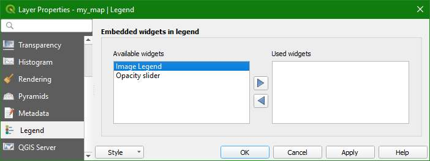

 
## *ImageLegend_widget*: A QGIS layer tree (Legend) widget for displaying image legend in a raster layer.

V1.2 - 11 September 2019

This widget works only on QGIS version >= 3.4.

This QGIS layer tree widget adds an "Image Legend" entry into the Legend tab of a raster layer properties.

In order to display an image of a legend, the legend file must be a **png** or **jpg** file named as *raster_filename.legend.png* or *raster_filename.legend.jpg*

where *raster_filename*: is the name, without extension, of the raster displayed in QGIS and ***.legend.png*** or ***.legend.jpg*** is the fixed identity given to the sidecar hosting the legend.

User manual [here](https://www.geoproc.com/be/image_legend_widget.htm) 
GeoProc.com plugins repository for QGIS [here](https://www.geoproc.com/be/plugins.xml)

Distributed under the GPL licence.
